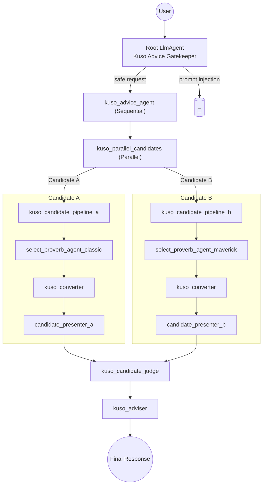

# kuso-agent
相談をするとクソなアドバイスをしてくれるクソエージェント

## setup
1. `.env` を作成 `cp .env.example .env`
1. `.env` に API key など必要な値を設定

### Docker Compose での実行

1. `docker compose up -d`

`.env` はコンテナに自動で渡されます (ポートは固定で 8000 を使用)。ソースは `./kuso-agent` -> `/app/kuso-agent` にマウントされるため、ホストでの編集が即コンテナに反映されます。

### ローカルセットアップ (uv)

1. `uv sync`
1. `uv run adk web`

### 動作確認
1. ブラウザで `http://localhost:8000`

## Agent Pipeline



## Config Layout

すべてのADKコンフィグを `kuso_agent_v2/configs` 以下に再配置しました。エントリーポイントの `root_agent.yaml` はこれまで通り `kuso_agent_v2` 直下に置き、その配下で用途ごとに階層化しています。

```
kuso_agent_v2/
  root_agent.yaml            # ゲートキーパー (エントリーポイント)
  configs/
    pipelines/               # シーケンシャル/並列パイプライン
      kuso_advice_agent.yaml
      kuso_parallel_candidates.yaml
      candidates/
        kuso_candidate_pipeline_a.yaml
        kuso_candidate_pipeline_b.yaml
    selectors/               # ことわざ選定エージェント
    converter/               # くそ変換器
    presenters/              # 候補フォーマッター
    judge/                   # 候補審査官
    adviser/                 # 最終アドバイザー
  tools/
    proverbs.py
```

以前 `tmp/` 以下に置かれていた重複した設定ファイルは削除してあり、単一のソースを参照するようになっています。
