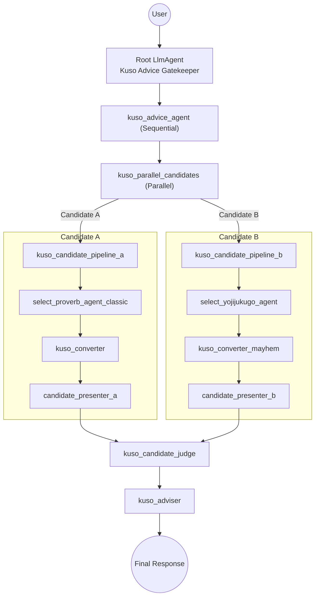

# kuso-agent
相談をするとクソなアドバイスをしてくれるクソエージェント

## setup
1. `.env` を作成 `cp .env.example .env`
1. `.env` に API key など必要な値を設定

### Docker Compose での実行

1. `docker compose up -d`

`.env` はコンテナに自動で渡されます (ポートは固定で 8000 を使用)。ビルド済みイメージ内で実行するため、コードを編集する場合は再ビルドしてください。

### ローカルセットアップ (uv)

1. `uv sync`
1. `uv run adk web`

### 動作確認
1. ブラウザで `http://localhost:8000`

## Agent Pipeline



- Candidate A uses `select_proverb_agent_classic` + `get_japanese_proverb_list_tool` for 堅実な和製ことわざ。
- Candidate B uses `select_yojijukugo_agent` + `get_yojijukugo_list_tool` to vandalize 四字熟語 with 糞ハック。

## Config Layout

すべてのADKコンフィグを `kuso_agent/configs` 以下に再配置しました。エントリーポイントの `root_agent.yaml` は `kuso_agent` 直下に置き、その配下で用途ごとに階層化しています。

```
kuso_agent/
  root_agent.yaml            # ゲートキーパー (エントリーポイント)
  configs/
    pipelines/               # シーケンシャル/並列パイプライン
      kuso_advice_agent.yaml
      kuso_parallel_candidates.yaml
      candidates/
        kuso_candidate_pipeline_a.yaml
        kuso_candidate_pipeline_b.yaml
    selectors/               # ことわざ選定エージェント
    converter/               # くそ変換器
    presenters/              # 候補フォーマッター
    judge/                   # 候補審査官
    adviser/                 # 最終アドバイザー
  tools/
    proverbs.py             # 日本ことわざ/グローバル/四字熟語ツール
```
